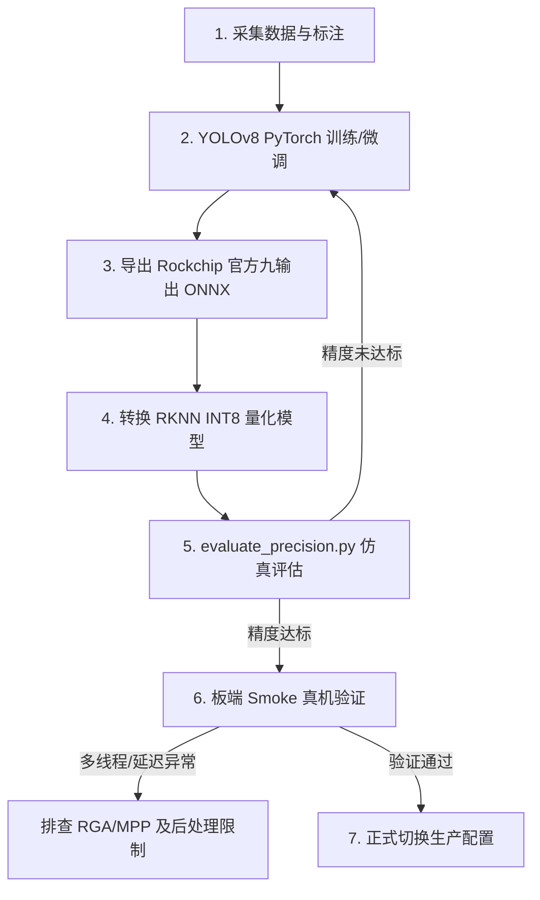

# YOLOv8s-RK3588 桌面六类数据集与微调方案

本文档定义了 AlertGateway 桌面场景六类目标的本地数据集设计、数据采集要求、标注规范及微调、导出、量化、验证的全流程规范。

## 1. 目标类别

微调模型应专注于以下 6 类业务关注的目标：

| 类别名称 (YOLO Label) | 对应 COCO 类别 | 描述 |
| :--- | :--- | :--- |
| `cell phone` | 手机 | 桌面放置的各类智能手机 |
| `cup` | 杯子 | 玻璃杯、马克杯、保温杯及易拉罐等饮料容器 |
| `keyboard` | 键盘 | 各类电脑键盘、笔记本自带键盘 |
| `mouse` | 鼠标 | 各类有线或无线鼠标 |
| `laptop` | 笔记本/显示器 | 笔记本电脑或桌面独立显示器 |
| `book` | 书本 | 书籍、笔记本、说明书等纸质印刷品 |

## 2. 数据集目录结构建议

为了避免将大量的重型图片与标注数据纳入 Git 仓库导致版本库臃肿，**强烈建议将数据集存放在仓库外路径**，例如 `/home/rambos/datasets/alertgateway_desktop6`。

数据集标注格式采用标准的 YOLOv8 TXT 格式，其目录层级建议如下：

```text
/home/rambos/datasets/alertgateway_desktop6/
├── data.yaml            # 类别配置与路径定义（YOLOv8 训练使用）
├── classes.txt          # 类别名称清单
├── train/
│   ├── images/          # 训练集图像 (如 .jpg)
│   └── labels/          # 训练集标注文件 (每个图像对应一个 .txt)
├── val/
│   ├── images/          # 验证集图像
│   └── labels/          # 验证集标注文件
└── test/
    ├── images/          # 测试集图像
    └── labels/          # 测试集标注文件
```

### data.yaml 配置文件示例
```yaml
path: /home/rambos/datasets/alertgateway_desktop6
train: train/images
val: val/images
test: test/images

names:
  0: cell phone
  1: cup
  2: keyboard
  3: mouse
  4: laptop
  5: book
```

## 3. 数据采集与 SRS 依赖说明

### 3.1 采集路径
优先采用**板端本地存储**方式采集图像，避免对外部 SRS 流媒体服务器产生强依赖。
* **本地 FLV 推流/写入**：修改板端配置文件，将 `stream.rtmp_url` 临时设置为本地路径（如 `/tmp/collect_desk.flv`），运行 `AlertGateway` 写入 flv 文件，之后下载该文件并使用 ffmpeg 或 opencv 抽帧。
* **本地抓图工具**：直接使用 v4l2 命令行工具（如 `v4l2-ctl`）或简单的 Python 脚本从 `/dev/video20` 直接捕获原生的 YUYV 帧并存为 PNG/JPG。

### 3.2 什么时候需要开启 SRS 服务？
仅在以下情况下才需要启动主机或远端部署的 SRS 容器服务：
1. **完整 RTMP 推流 Smoke 验证**：在全链路联调阶段，需要验证 C++ 推流线程、MPP H.264 编码、RTMP 发布以及流媒体服务器连通性时。
2. **远程拉流抓帧**：需要验证远程网络客户端拉取 RTMP 流并成功解码/抓图的兼容性时。

## 4. 拍摄与场景覆盖要求

为保障微调后的模型在多变桌面环境下具有高泛化能力与抗干扰性，数据捕获时应主动设计并覆盖以下维度：

* **光照与阴影**：包含正常室内日光、偏暗/夜间日光灯、局部手电强光照射、强逆光以及阴影遮挡。
* **反光与镜面**：覆盖不锈钢杯具、显示器镜面、光滑桌面的反光干扰。
* **距离与多尺度**：包含近距离特写（大目标）、中等距离常规视角、以及远距离小视角（小目标）。
* **拍摄角度**：包含俯视（Top-down）、平视、大侧角、广角镜头畸变边缘等。
* **局部遮挡**：模拟真实场景，包含目标被双手遮挡、书籍压住键盘边缘、水杯遮挡键盘等。
* **背景多样性**：不仅包含木质桌面，还应涵盖浅色塑料桌、深色毛毡垫、杂乱的背景环境（如背景中的衣架、衣物、背包）。
* **目标数量变化**：包含单张图像只有一个目标、同时摆放 6 类目标、以及无任何目标的**空桌面负样本（Negative Samples）**。
* **负样本要求**：标注空桌面或仅包含非 6 类目标的杂物桌面（如包装盒、纸巾盒），且**标注对应的 labels 文件为空文件（0 字节）**，用于抑制背景误检。

## 5. 数据量建议

根据当前阶段的硬件限制与桌面验证集精度情况，推荐采用以下两级规模规划：

* **最小可行规模 (MVP)**：
  * 每个目标类别不少于 **100** 个独立实例（跨不同背景与角度）。
  * 至少包含 **50** 张空桌面或非目标背景负样本图像。
  * 总图片量在 **300 - 500** 张左右。
* **推荐生产规模**：
  * 每个目标类别不少于 **500** 个独立实例。
  * 至少包含 **200** 张多场景负样本图像。
  * 总图片量在 **1500 - 2000** 张左右。

> [!IMPORTANT]
> **绝对不能**将现有的 30 帧桌面抽帧固定验证集（`desktop_gt.json` 对应的 `det_A_*.jpg` 帧）混入训练集（train）中。该 30 帧应严格作为独立的外部测试集/验证集，用于量化对比微调前后的指标。

## 6. 评估原则与指标对齐

微调后的模型评估必须采用统一的基准进行，且使用当前已有的离线精度评估脚本进行测试：

1. **测试基准**：运行 `evaluate_precision.py` 评估微调后的模型。
2. **后处理阈值对齐**：
   * 置信度过滤阈值 `conf_threshold = 0.25`
   * NMS 重叠阈值 `nms_threshold = 0.45`
   * 评估匹配 IoU 阈值 `eval_iou_threshold = 0.50` (即 mAP@0.5)
3. **输出核心指标**：
   * 各类别的 **Recall**（召回率）：特别是之前漏检的易拉罐等小目标。
   * 各类别的 **Precision**（精准率）：特别关注 Dell 显示器等是否有错检混淆。
   * 整体的 **mAP@0.5**（平均精度）。
   * 记录**误检数量**与**漏检数量**，并导出典型错检/漏检样本进行主观画质缺陷分析。

## 7. 后续微调与板端部署完整流程

微调到部署应遵循以下严格的流程闭环：



### 流程细节说明：
1. **微调训练**：使用 PyTorch 环境进行微调训练，得到六分类 YOLOv8s 权重。
2. **导出 ONNX**：使用 Rockchip 专属的 `ultralytics_yolov8` 定制库（`rk_opt_v1.6` 分支）导出具有 **9 输出**（带有求和分支、移除了 DFL 和后处理）的原生 ONNX。
3. **转换 RKNN**：使用 `convert_int8.py` 和对应尺寸的板端校准集图像转换得到全 INT8 RKNN 模型。
4. **离线评估**：利用 Simulator 仿真加载新 RKNN 模型跑 `evaluate_precision.py`，确认其 mAP@0.5 指标优于当前 640x640 基线（桌面验证集 mAP >= 48.33%）。
5. **真机验证**：将模型部署至板端运行 `AlertGateway`，进行至少 60 秒的 Smoke 验证。日志应确认 `outputs=9` 模式，且各阶段运行稳定、内存无泄露、退出优雅。

## 8. 实际采集与整理命令模板

采集前可先运行 `tools/dataset/collect_desktop6_checklist.sh` 查看完整操作清单；该脚本只打印步骤，不会执行真实采集或修改配置。

在进行实际图像采集和数据集准备时，可以使用以下命令模板进行操作：

### 8.1 板端本地 FLV 写入方案
1. **修改板端配置**：登录板端，临时修改 `~/AlertGateway/config/config.json`，将推流 URL 设置为板端本地路径，例如：
   ```json
   "stream": {
     "rtmp_url": "/tmp/collect_desktop.flv",
     "bitrate_kbps": 2000,
     "draw_detection_labels": true
   }
   ```
   采集结束后应恢复原生产 RTMP 地址，避免后续 smoke 误写本地文件。
2. **运行采集**：在板端执行可执行程序以获取真实摄像头的原始视频，可以使用 `timeout` 限制运行时间（例如运行 60 秒以捕获约 900 帧）：
   ```bash
   # 板端执行
   cd ~/AlertGateway
   timeout 60 ./AlertGateway config/config.json
   ```
3. **拉取视频到主机**：在 Host 主机上执行命令将视频文件拉回：
   ```bash
   scp firefly@192.168.0.200:/tmp/collect_desktop.flv /home/rambos/datasets/
   ```

### 8.2 从 FLV 抽帧命令
在 Host 主机上，使用 `ffmpeg` 对拉回的视频进行等间隔（例如每秒抽 1 帧）的抽帧，以减少图像相似度：
```bash
# 在主机上运行，按 1 FPS 将帧提取为 JPEG 格式
mkdir -p /home/rambos/datasets/raw_extracted
ffmpeg -i /home/rambos/datasets/collect_desktop.flv -vf "fps=1" -q:v 2 /home/rambos/datasets/raw_extracted/raw_desktop_%04d.jpg
```

### 8.3 图片命名规则
为了便于管理、筛选和定位特定的检测环境干扰，所有采集图片的命名建议包含**场景/状态标识符**：
* 格式：`src_[scene_desc]_[frame_idx].jpg`
* 示例：
  * 正常光照桌面：`src_desk_normal_0001.jpg`
  * 存在反光/强光桌面：`src_desk_glare_0012.jpg`
  * 空桌面（负样本）：`src_desk_empty_0045.jpg`

### 8.4 train/val/test 拆分建议
1. **拆分比例**：推荐采用 **8:1:1** 的比例划分数据集（80% 用于训练，10% 用于验证，10% 用于测试）。
2. **时序隔离（防数据泄漏）**：**切勿**将同一段连续抽帧视频中的前后帧混分在训练集与验证集中。由于相邻帧内容高度重合，混分会导致验证集评估精度虚高（过拟合风险）。
3. **拆分原则**：将同一次拍摄、同一视角或同一个光照场景的整组图片归为一个独立的划分，或在不同录像会话（Session）之间进行划分。
